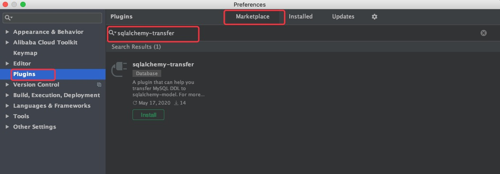

# sqlalchemy-transfer

A plugin that can help you transfer `MySQL DDL` to `sqlalchemy-model`.

# Installation

- [Plugin market](https://plugins.jetbrains.com/plugin/14219-sqlalchemy-transfer/)
- [Manual installation](https://github.com/crossoverJie/sqlalchemy-transfer/releases)

# Waring:

1. Cannot include `() ;` in comments. 
